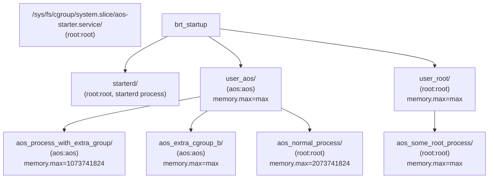

# Cgroups v2 Hierarchy

In cgroups v2, for a process running as a normal user to be able to move a process from
and to a cgroup owned by that user, the common ancestor must also be owned by that user - see
https://www.kernel.org/doc/html/latest/admin-guide/cgroup-v2.html#delegation-containment .
One way to solve this problem is to introduce intermediate cgroups owned by that user.

## Example Configuration

The following AOS application configuration JSON would result in the cgroup hierarchy shown below:

```json
{
  "applications": [
    {
      "name": "process_with_extra_group",
      "user": "aos",
      "memory_limit" : 1073741824,
      "extra_cgroups": ["extra_cgroup_b"]
    },
    {
      "name": "normal_process",
      "user": "aos",
      "memory_limit" : 2073741824,
    },
    {
      "name": "some_root_process",
      "user": "root"
    }
  ]
}
```



